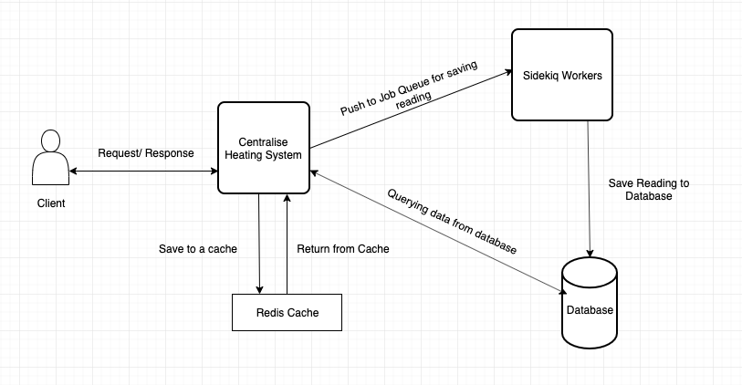

# Centralise Heating System Management

This is an MVP for reading thermostat and returning max, avg and min readings for each thermostat.


## System Design




## Setup

After cloning repo, run from your project root directory. 

```
$ bundle install
``` 

**Create Database**

```
$ rake db:create
$ rake db:migrate
$ rake db:seed
```

Assuming **redis-server** is installed already. we use redis server for cacheing and also for job queue. once bundle install get completed please make sure you have started sidekiq using 

**Setup Sidekiq**

```
$ bundle exec sidekiq -d -l log/sidekiq.log
```

then run,

```
$ rails s
```

> As this is running in development mode performance wise this might varies compare to production build. were we will be having multiple cache servers, Rails Applications for handling more requests.


## API Docs

Inorder to authenticate the api we add thermostat `household_token` request header.

1) **Add Reading**

```
  Endpoint: 'http://localhost:3000/v1/readings'
  Method: POST
  Authentication: true
  Header
  {
    Authorization: 'ddasdasdaswewe'
  }


  Request Params

  {
    "reading":{
      "tracking_number": 1232456,
      "humidity": 35.24,
      "temperature": 13.34,
      "battery_charge": 25
    }
  }


  Response

  {
    "tracking_number": 1232456,
    "humidity": 35.2,
    "temperature": 13.34,
    "battery_charge": 25
  }
```

2) **Get Reading**

```
  Endpoint: 'http://localhost:3000/v1/readings/1232456'
  Method: GET
  Authentication: true
  Header
  {
    Authorization: 'ddasdasdaswewe'
  }

  Request Params


  Response

  {
    "tracking_number": 1232456,
    "humidity": 35.2,
    "temperature": 13.34,
    "battery_charge": 25
  }
```

3) **Get Stats of Thermostat**

```
  Endpoint: 'http://localhost:3000/v1/readings'
  Method: GET
  Authentication: true
  Header
  {
    Authorization: 'ddasdasdaswewe'
  }

  Request Params


  Response

  {
    "max_humidity": 35.24,
    "max_temperature": 14.34,
    "max_battery_charge": 50,
    "min_humidity": 32.2,
    "min_temperature": 12.34,
    "min_battery_charge": 25,
    "avg_humidity": 34.21,
    "avg_temperature": 13.34,
    "avg_battery_charge": 31.25
  }
```


